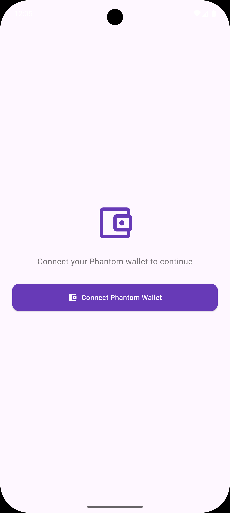
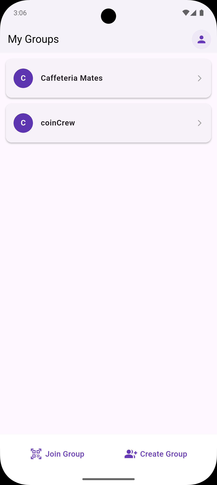
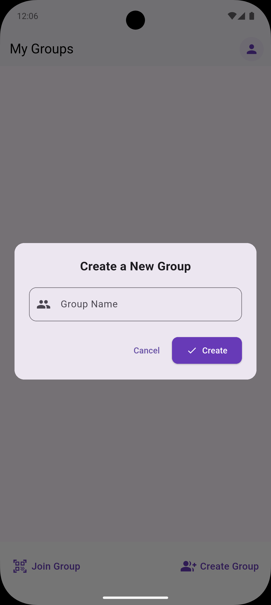
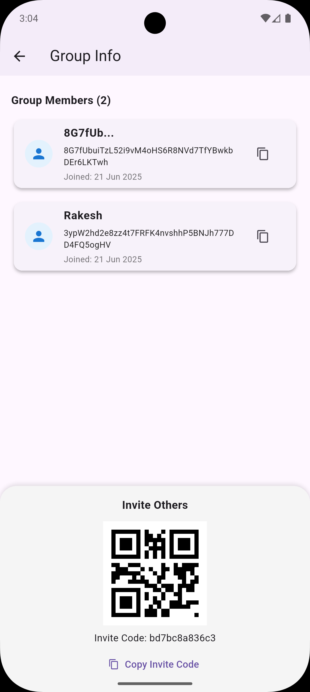
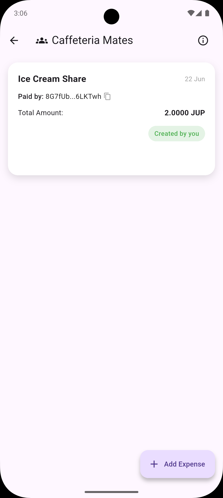
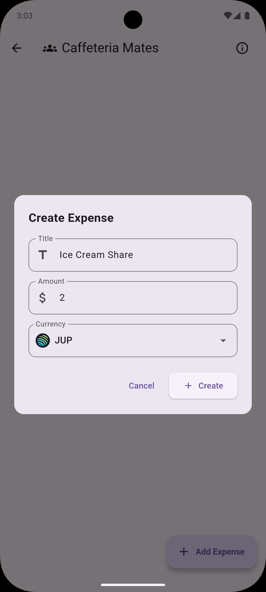
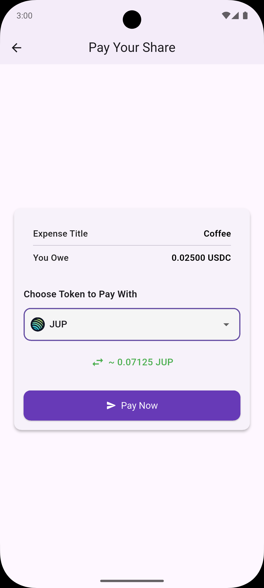
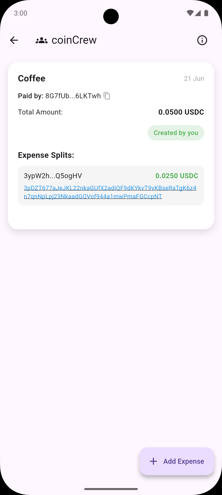
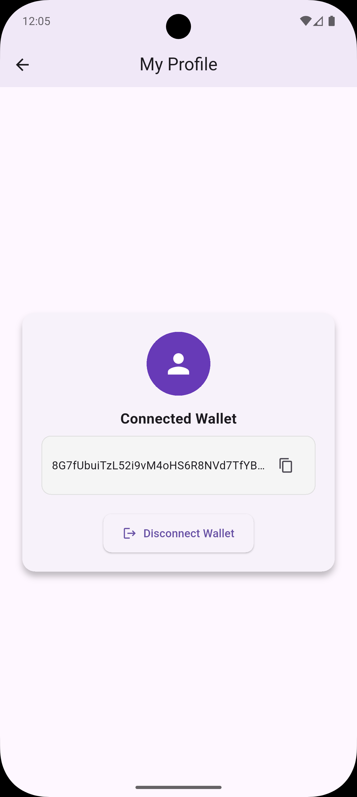

# SwapPay

> A Solana-native bill splitting app powered by the Jupiter Swap Aggregator.

A Flutter application for managing group expenses, splitting bills, and tracking payments among friends or groups — inspired by apps like Splitwise — but powered by Solana and Jupiter for seamless token-based settlements.

---

## 🧩 Problem

Most expense-splitting apps assume a shared currency or payment system. In crypto ecosystems, people hold different tokens — BONK, JUP, SOL, USDC, etc.

Traditional tools fall short here.

### 🔥 Enter: **SwapPay**

- Pay with **any SPL token**
- Recipient gets paid in their **preferred token**
- All swaps handled automatically using **Jupiter Aggregator**

**Example:**
> Rent = 180 USDC  
> A pays 500,000 BONK  
> B pays 2 JUP  
> → Recipient gets 180 USDC — auto-converted


---

## 📱 Download

You can download and try the app using the APK below:

[](https://drive.google.com/file/d/1k0aGz_RmIY5oE6y4G9skWyXX3LzOc68T/view?usp=sharing)

---


## Table of Contents

- [Features](#features)
- [Tech Stack](#tech-stack)
- [Screenshots](#screenshots)
- [Getting Started](#getting-started)
- [Project Structure](#project-structure)
- [Main Models](#main-models)
- [Main Screens](#main-screens)
- [Dependencies](#dependencies)

---

## Features

- 🔐 **Secure Wallet Login**
- 👥 **Group Management** — create, join, and manage groups
- 📊 **Track Expenses** — view all splits and history
- 🔄 **Auto Token Swaps** via Jupiter Aggregator
- 💰 **Multi-token Payments** — settle in any SPL token
- ✅ **Real-time Settlement Status**
- 🧾 **Transaction Explorer** links (e.g., Solscan)

---

## Tech Stack

| 🚀 Technology            | 📝 Description                                     |
|-------------------------|--------------------------------------------------|
| 🐦 **Flutter**           | Cross-platform UI toolkit for building the app  |
| ⚙️ **GetX**              | Lightweight state management, routing & DI      |
| 🔗 **Solana**            | Blockchain for wallet auth & token transfers    |
| 🔁 **Jupiter API**       | Token swap engine for SPL tokens                |
| 🧠 **Solana Web3 SDK**   | Transaction generation & signing (JS/Go)        |
| 🎨 **Material Design**   | Modern UI components and theming                |


---

## Screenshots

<div align="center">

<table>
  <tr>
    <td align="center"><strong>🔐 Wallet Connect</strong></td>
    <td align="center"><strong>🏠 Groups Screen</strong></td>
    <td align="center"><strong>➕ Create Group</strong></td>
  </tr>
  <tr>
    <td></td>
    <td></td>
    <td></td>
  </tr>
  <tr>
    <td align="center"><strong>📨 Invite to Group</strong></td>
    <td align="center"><strong>📋 Expenses Screen</strong></td>
    <td align="center"><strong>✍️ Create Expenses</strong></td>
  </tr>
  <tr>
    <td></td>
    <td></td>
    <td></td>
  </tr>
  <tr>
    <td align="center" ><strong>💸 Pay Expense</strong></td>
    <td align="center" ><strong>✅ Settled Expense</strong></td>
    <td align="center" ><strong>👤 My Profile</strong></td>
  </tr>
  <tr>
    <td  align="center"></td>
    <td  align="center"></td>
    <td  align="center"></td>
  </tr>
</table>

</div>


---

## Getting Started 

### Prerequisites

- [Flutter SDK](https://flutter.dev/docs/get-started/install)
- Dart >= 2.17.0
- A device or emulator to run the app

### Installation

1. **Clone the repository:**
   ```sh
   git clone https://github.com/dontaskit28/jup-split-wise.git
   cd jup-split-wise
   
2. **Fetch dependencies:**
   
    ```sh
   flutter pub get
    ```

3. **Run the app:**
   
    ```sh
   flutter run
    ```

## Project Structure

    ```plaintext
    lib/
    ├── controllers/          # Business logic (AuthController, GroupController, etc.)
    ├── models/               # Data models (Group, Expense, Split, Coin, etc.)
    ├── screens/
    │   ├── auth/             # Login, wallet connect
    │   ├── groups/           # Group list, group detail, join/scan screen
    │   ├── expenses/         # Pay expense screen
    │   └── profile/          # Profile & settings screen
    ├── services/             # APIs (Jupiter swap, Solana wallet helper)
    ├── routes/               # Route names & GetX navigation
    ├── utils/                # Formatting, helper functions
    ├── widgets/              # Reusable components (custom buttons, cards, etc.)
    └── main.dart             # App entry point
    ```


## Main Models

- [coins_data.dart](lib/models/coins_data.dart): Manages supported coins/currencies for splitting.
- [expense_model.dart](lib/models/expense_model.dart): Represents an expense, with details like amount, payer, and group.
- [group_model.dart](lib/models/group_model.dart): Represents a group, including members and expenses.
- [member_model.dart](lib/models/member_model.dart): Represents a group member.
- [split_model.dart](lib/models/split_model.dart): Handles the logic for splitting expenses.

## Main Screens

- [login_screen.dart](lib/screens/login_screen.dart): User authentication and login UI.
- [home_screen.dart](lib/screens/home_screen.dart): Main dashboard displaying groups and actions.
- [group_screen.dart](lib/screens/group_screen.dart): Lists all groups a user is part of.
- [group_detailed.dart](lib/screens/group_detailed.dart): Detailed view of a group, including expenses and balances.
- [group_info_screen.dart](lib/screens/group_info_screen.dart): Shows group information and member list.
- [join_group_screen.dart](lib/screens/join_group_screen.dart): UI for joining a new group.
- [pay_expense_screen.dart](lib/screens/pay_expense_screen.dart): Screen for settling debts/payments.
- [profile_screen.dart](lib/screens/profile_screen.dart): User profile management.

Each screen is modular and managed via [GetX](https://pub.dev/packages/get) for routing and state management.

## App Entry Point

The app initializes in [main.dart](lib/main.dart):
```sh
void main() {
  runApp(const BillSplitApp());
}
```


- Uses GetMaterialApp for navigation.
- AuthController is injected for global access.
- Initial navigation is set to the login screen.

## Dependencies

- **Flutter**: UI toolkit for building natively compiled apps.
- **GetX**: State management, routing, and dependency injection.
- **Material Design**: Standard Flutter material widgets.

_See pubspec.yaml for the full list of dependencies._

---
## 🤝 Contributing

Pull requests are welcome! Please open issues first to discuss new ideas or report bugs.

1. Fork the repo
2. Create your feature branch: `git checkout -b feature/my-feature`
3. Commit your changes: `git commit -am 'Add feature'`
4. Push to the branch: `git push origin feature/my-feature`
5. Open a pull request

